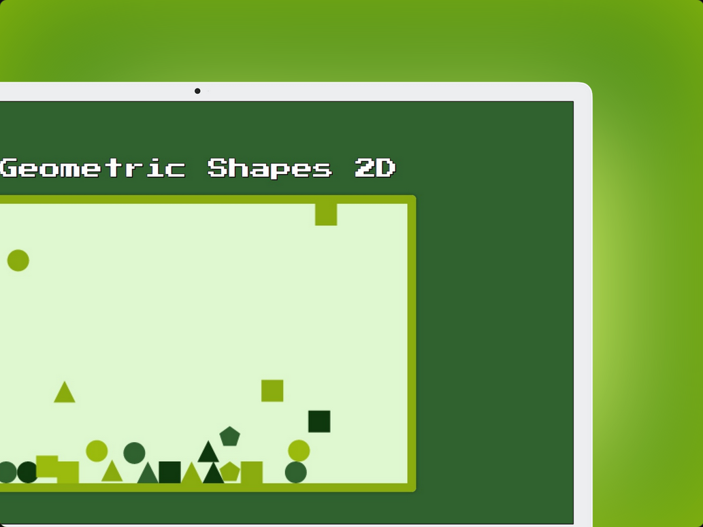
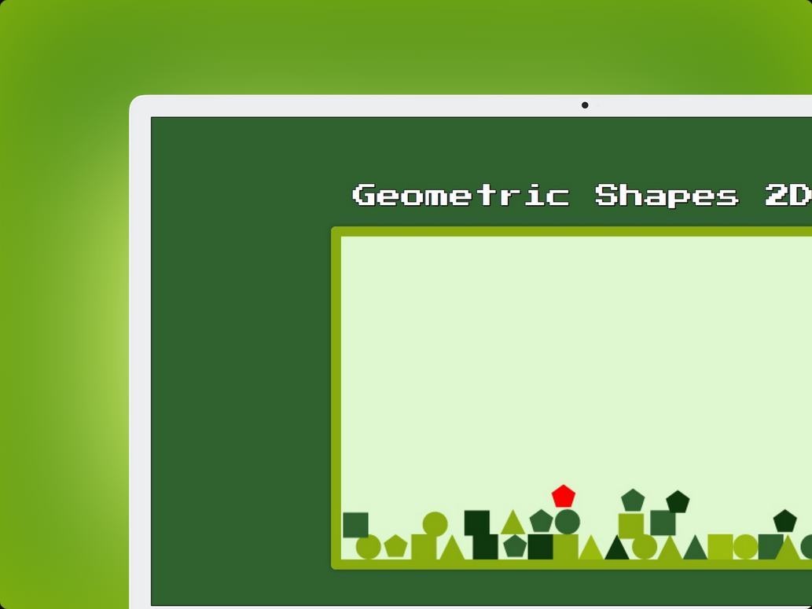
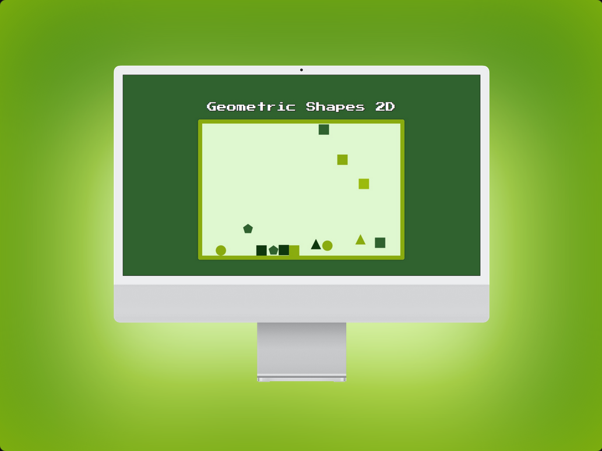

# Geometric Shapes 2D

**Geometric Shapes 2D** es un proyecto interactivo creado como mi primer proyecto con Astro. En este proyecto, figuras geométricas caen desde la parte superior del canvas y, al hacer clic y mantener el mouse presionado sobre una figura, su velocidad aumenta proporcionalmente al tiempo que se mantiene el clic.

## Tecnologías Utilizadas

- **Astro:** Framework para generar sitios web modernos y rápidos.
- **JavaScript:** Lenguaje de programación utilizado para la lógica del juego y la interacción.
- **CSS:** Estilos para el diseño y la presentación del canvas.

## Descripción del Proyecto

En **Geometric Shapes 2D**, las figuras geométricas caen por la pantalla bajo la influencia de la gravedad. Al hacer clic en una figura y mantener el clic presionado, la figura se moverá hacia arriba con una velocidad que aumenta de acuerdo con la duración del clic. La aplicación simula un entorno físico simple con colisiones entre figuras y los bordes del canvas.

El proyecto fue desarrollado como una oportunidad para aprender y experimentar con Astro, y aunque todavía me queda mucho por aprender sobre este framework, estoy muy orgulloso del resultado.

## Capturas de Pantalla

Aquí se muestran algunas capturas de pantalla de la aplicación:

    <table>
        <tr>
            <td>
                
            </td>
            <td>
                
            </td>
        </tr>
        <tr>
            <td colspan="2">
                
            </td>
        </tr>
    </table>

## Agradecimientos

Quiero agradecer a la empresa **Ludik** por la prueba técnica que me permitió desarrollar este proyecto. También quiero expresar mi gratitud a Fazt Code y otros tutoriales de YouTube que me ayudaron a aprender sobre Astro y mejorar mis habilidades en desarrollo web.
